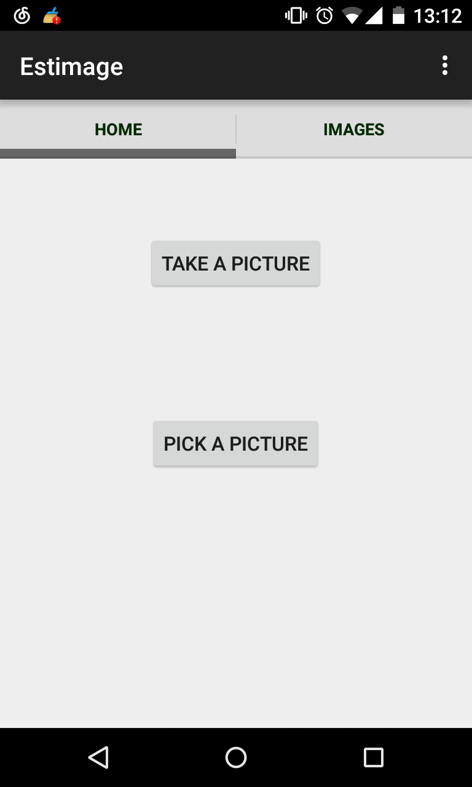
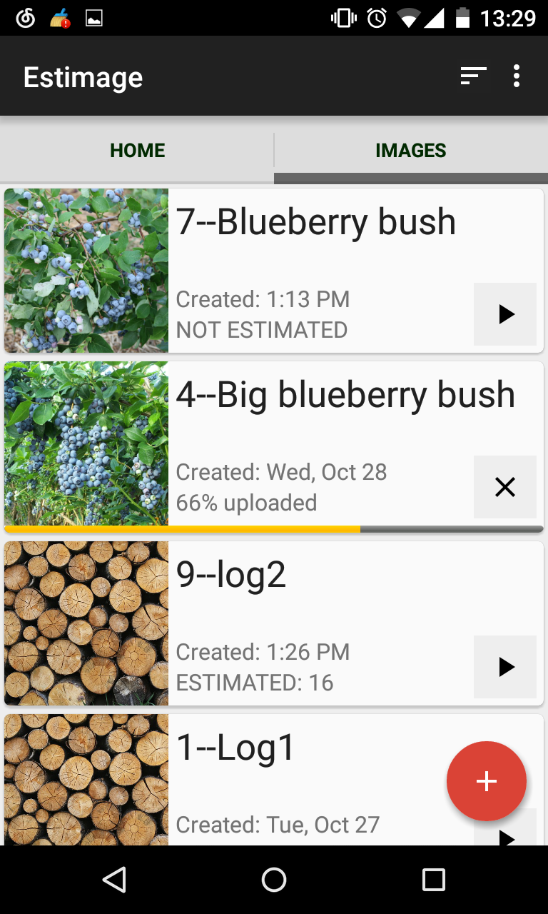
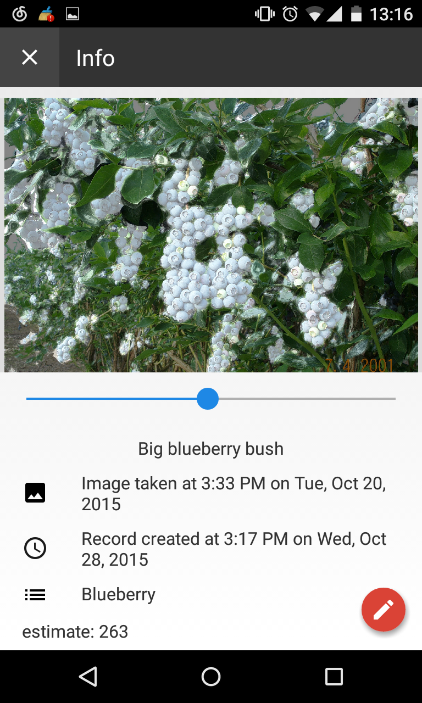
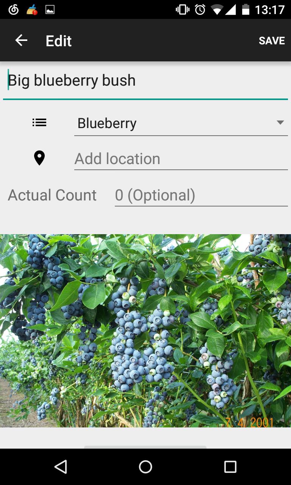
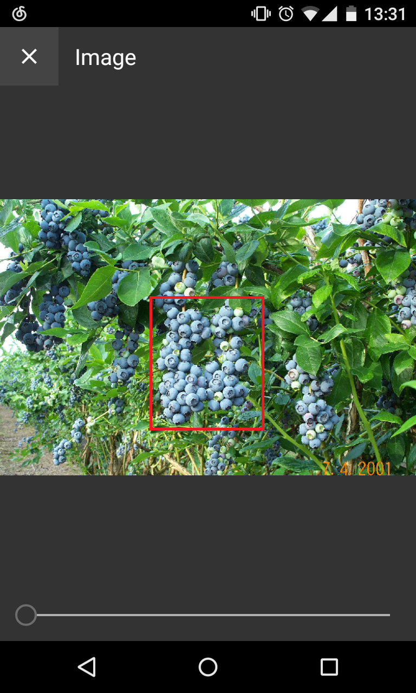
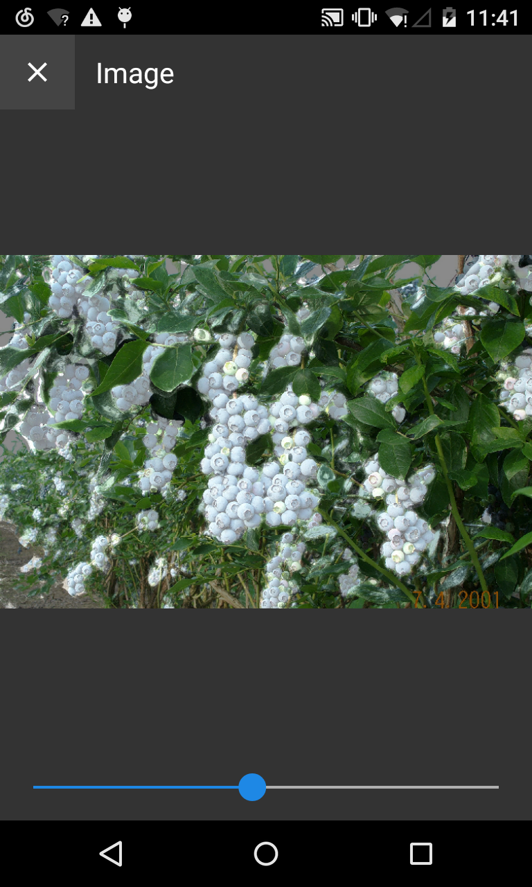
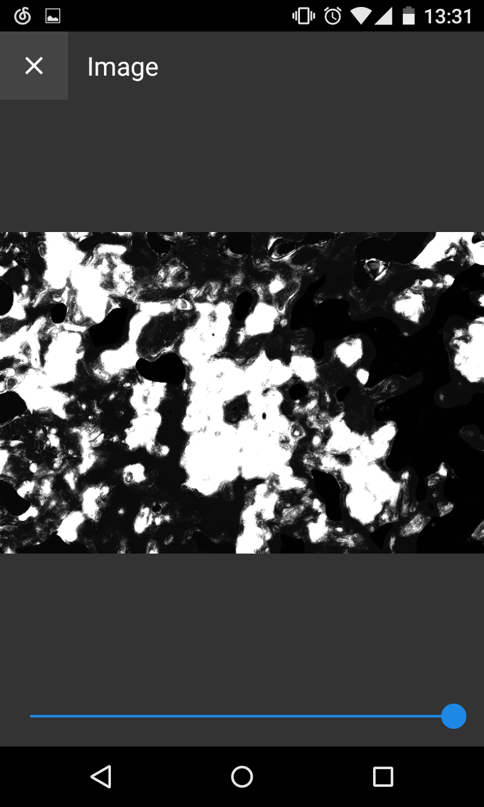
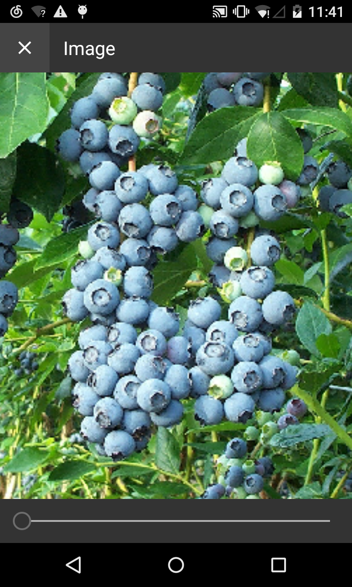
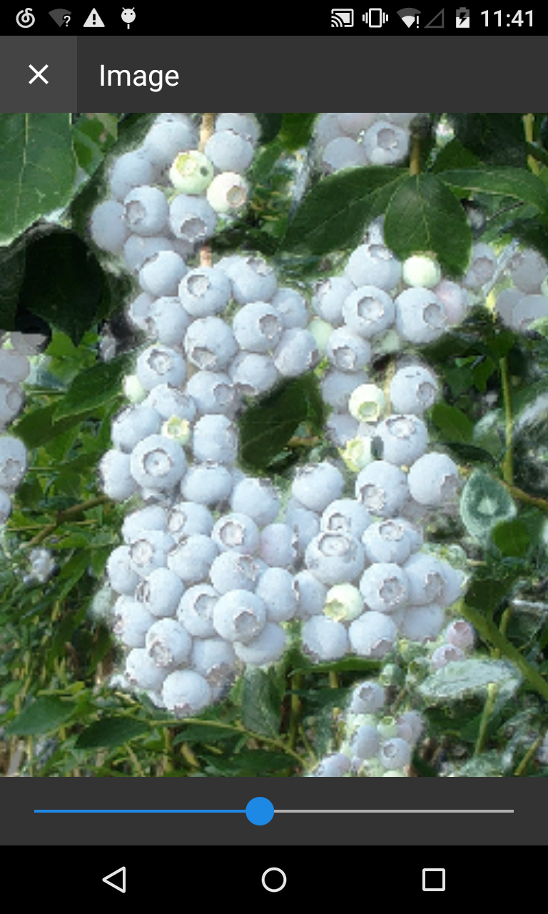
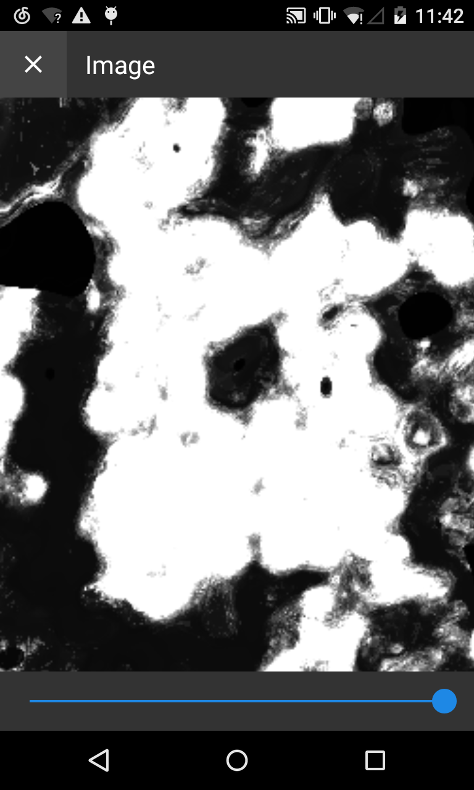

# Image To Object Count Estimator
This Android application has two interfaces to start with. 

The HOME interface allows users to create an image record by taking a picture with camera or picking an image from local directory.

The IMAGES interface shows up a list of image records that users created previously, and each item displays title, creation date and estimation status.
We also can start an estimation on any image via the start button of each image record on the right.

The INFO interface can be accessed by clicking on any image record in the IMAGES interface.

The EDIT interface allows edition on an image record.

Once we click on the image on the INFO interface, the following interface shows up, and we can see how good the image is estimated. 

Dark color means irrelated pixels, while white color means target pixels.

We also can zoom in or out the selected image to see the details.

